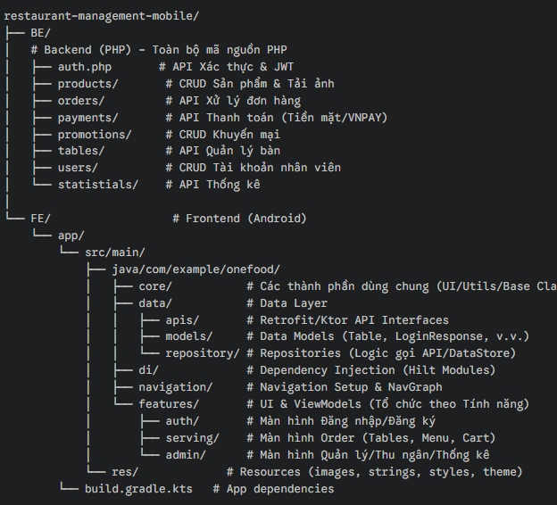

#  Hệ thống Quản lý Nhà hàng OneFood (OneFood Restaurant Management System)

##  Mô tả dự án
OneFood là một ứng dụng di động (nền tảng Android) được thiết kế để hỗ trợ các nhà hàng quản lý các hoạt động hàng ngày, từ việc nhận order và xử lý thanh toán đến quản lý sản phẩm, nhân viên và doanh thu. Dự án này sử dụng PHP và MySQL cho Backend, cung cấp một RESTful API để tích hợp liền mạch với ứng dụng di động Android được xây dựng bằng Jetpack Compose. Hệ thống được tối ưu hóa cho các nhà hàng quy mô nhỏ đến vừa, mang lại giao diện trực quan và quy trình làm việc hiệu quả.
---

## 👥 Đối tượng người dùng
-  **Nhân viên Order (Phục vụ bàn)**  
-  **Nhân viên Thu ngân**  
-  **Quản lý (Manager)**  

---
## Cấu trúc dự án:
- 

---

##  Các chức năng chính:

- Quản lý Bàn (Table Management): Hiển thị bố cục bàn trực quan, cho biết trạng thái bàn (trống, có khách, đang phục vụ) với cập nhật theo thời gian thực.

- Quản lý Đơn hàng (Order Management): Tạo và quản lý đơn hàng bằng cách chọn bàn, thêm các món ăn với số lượng và ghi chú đặc biệt.

- Quản lý Sản phẩm (Product Management): Thêm, cập nhật, xóa và tìm kiếm sản phẩm theo tên, danh mục hoặc giá. Tải lên và quản lý hình ảnh sản phẩm.
 
- Xử lý Thanh toán (Payment Processing): Xử lý nhiều phương thức thanh toán bao gồm tiền mặt và mã QR (tích hợp VNPay) với hệ thống tự động tính toán chiết khấu.

- Quản lý Khuyến mại (Promotion Management): Tạo và quản lý các chiến dịch khuyến mại, mã giảm giá (discount codes) và voucher với hệ thống xác thực.

- Quản lý Nhân viên (Staff Management): Đăng ký và quản lý tài khoản nhân viên với kiểm soát truy cập dựa trên vai trò (Order Staff, Cashier, Manager).
 
- Thống kê Doanh thu (Revenue Statistics): Tạo các báo cáo về doanh số, doanh thu theo kỳ, và theo dõi chi tiết đơn hàng theo bàn.
 
- Truy cập dựa trên Vai trò (Role-Based Access): Giao diện và quyền hạn khác nhau cho các vai trò Order Staff, Cashier và Manager.

---

##  Lợi ích ứng dụng
- Nhân viên **order nhập trực tiếp → bếp nhận ngay**, giảm sai sót.  
- **Thu ngân** tính tiền nhanh, hạn chế nhầm lẫn.  
- **Quản lý** dễ dàng kiểm soát hoạt động, doanh thu, nhân sự.  
- Giao diện gọn nhẹ, trực quan, phù hợp nhà hàng vừa và nhỏ.

##  Công nghệ sử dụng
| Thành phần | Công nghệ |
|-------------|------------|
| **Backend** | PHP + MySQL |
| **Frontend (App)** | Jetpack Compose (Android) |
| **API Giao tiếp** | RESTful API |
| **IDE / Tools** | Android Studio, VS Code, Xampp |

----------------------------------------------------------------------------------
##  Cài đặt và chạy thử

### 🔧 Backend (PHP + MySQL)
1. Clone dự án:
   ```bash
   B1. git clone https://github.com/HuyIT2706/restaurant-management-mobile.git
   B2. cd folder FE
   B3. Ctr + Shift + O để biuld các thư viện của app sử dụng 
   B4. Chạy chương trình.

2. Đối với người dùng Android 

   ```bash
   B1: Quét mã QR 
   (+) 
   B2. Tải xuống và cài đặt chạy thử.

3. Thông tin ngân hàng test VNPAY
- 


